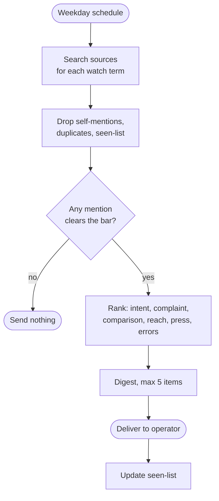

# brand-listener flow

```mermaid
flowchart TD
    A([Weekday schedule]) --> B[Search sources<br/>for each watch term]
    B --> C[Drop self-mentions,<br/>duplicates, seen-list]
    C --> D{Any mention<br/>clears the bar?}
    D -->|no| E([Send nothing])
    D -->|yes| F[Rank: intent, complaint,<br/>comparison, reach, press, errors]
    F --> G[Digest, max 5 items]
    G --> H([Deliver to operator])
    H --> I[Update seen-list]
```
