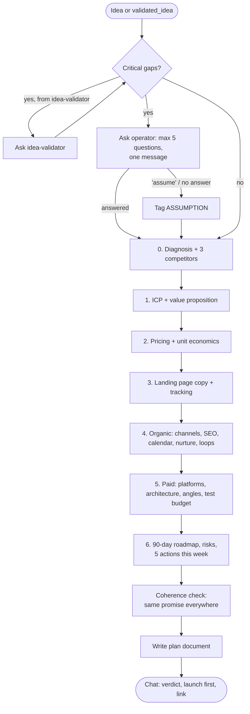

# growth-architect flow

```mermaid
flowchart TD
    A([Idea or validated_idea]) --> B{Critical gaps?}
    B -->|yes, from idea-validator| C[Ask idea-validator]
    C --> B
    B -->|yes| D[Ask operator: max 5 questions,<br/>one message]
    D -->|answered| E
    D -->|'assume' / no answer| D2[Tag ASSUMPTION] --> E
    B -->|no| E[0. Diagnosis + 3 competitors]
    E --> F[1. ICP + value proposition]
    F --> G[2. Pricing + unit economics]
    G --> H[3. Landing page copy + tracking]
    H --> I[4. Organic: channels, SEO, calendar, nurture, loops]
    I --> J[5. Paid: platforms, architecture, angles, test budget]
    J --> K[6. 90-day roadmap, risks,<br/>5 actions this week]
    K --> L[Coherence check:<br/>same promise everywhere]
    L --> M[Write plan document]
    M --> N([Chat: verdict, launch first, link])
```
