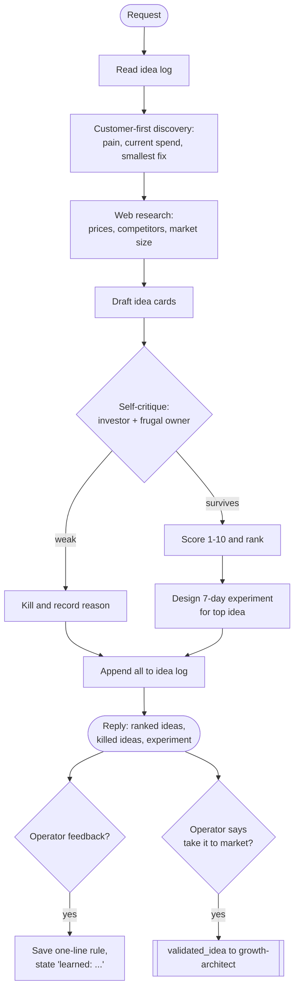

# idea-validator flow

```mermaid
flowchart TD
    A([Request]) --> B[Read idea log]
    B --> C[Customer-first discovery:<br/>pain, current spend, smallest fix]
    C --> D[Web research:<br/>prices, competitors, market size]
    D --> E[Draft idea cards]
    E --> F{Self-critique:<br/>investor + frugal owner}
    F -->|weak| G[Kill and record reason]
    F -->|survives| H[Score 1-10 and rank]
    H --> I[Design 7-day experiment<br/>for top idea]
    G --> J[Append all to idea log]
    I --> J
    J --> K([Reply: ranked ideas,<br/>killed ideas, experiment])
    K --> L{Operator feedback?}
    L -->|yes| M[Save one-line rule,<br/>state 'learned: ...']
    K --> N{Operator says<br/>take it to market?}
    N -->|yes| O[[validated_idea to growth-architect]]
```
