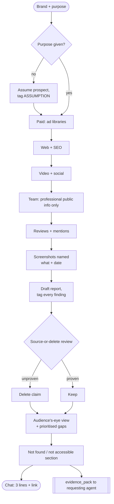

# market-intel flow

```mermaid
flowchart TD
    A([Brand + purpose]) --> B{Purpose given?}
    B -->|no| B2[Assume prospect,<br/>tag ASSUMPTION] --> C
    B -->|yes| C[Paid: ad libraries]
    C --> D[Web + SEO]
    D --> E[Video + social]
    E --> F[Team: professional public info only]
    F --> G[Reviews + mentions]
    G --> H[Screenshots named<br/>what + date]
    H --> I[Draft report,<br/>tag every finding]
    I --> J{Source-or-delete review}
    J -->|unproven| K[Delete claim]
    J -->|proven| L[Keep]
    K --> M
    L --> M[Audience's-eye view<br/>+ prioritised gaps]
    M --> N[Not found / not accessible section]
    N --> O([Chat: 3 lines + link])
    N --> P[[evidence_pack to requesting agent]]
```
