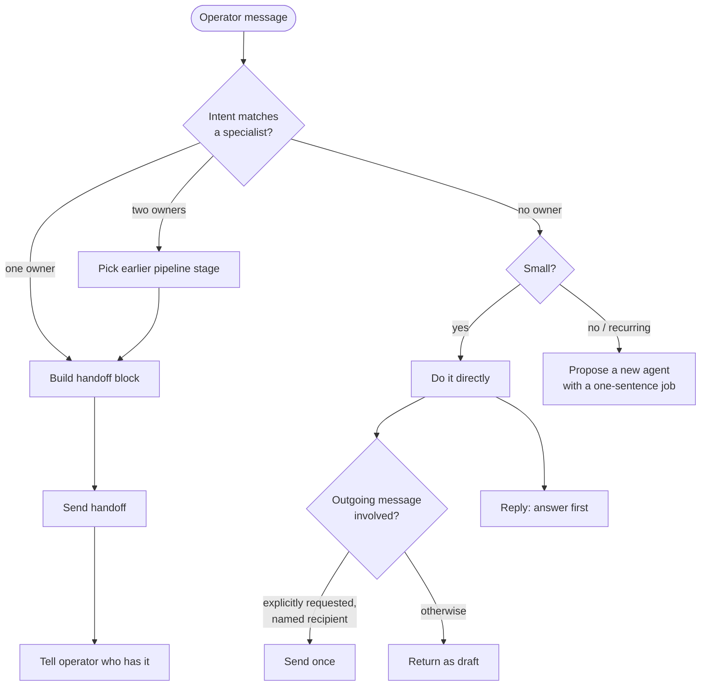

# router flow

```mermaid
flowchart TD
    A([Operator message]) --> B{Intent matches<br/>a specialist?}
    B -->|one owner| C[Build handoff block]
    B -->|two owners| D[Pick earlier pipeline stage] --> C
    B -->|no owner| E{Small?}
    E -->|yes| F[Do it directly]
    E -->|no / recurring| G[Propose a new agent<br/>with a one-sentence job]
    C --> H[Send handoff]
    H --> I[Tell operator who has it]
    F --> J{Outgoing message<br/>involved?}
    J -->|explicitly requested,<br/>named recipient| K[Send once]
    J -->|otherwise| L[Return as draft]
    F --> M[Reply: answer first]
```
